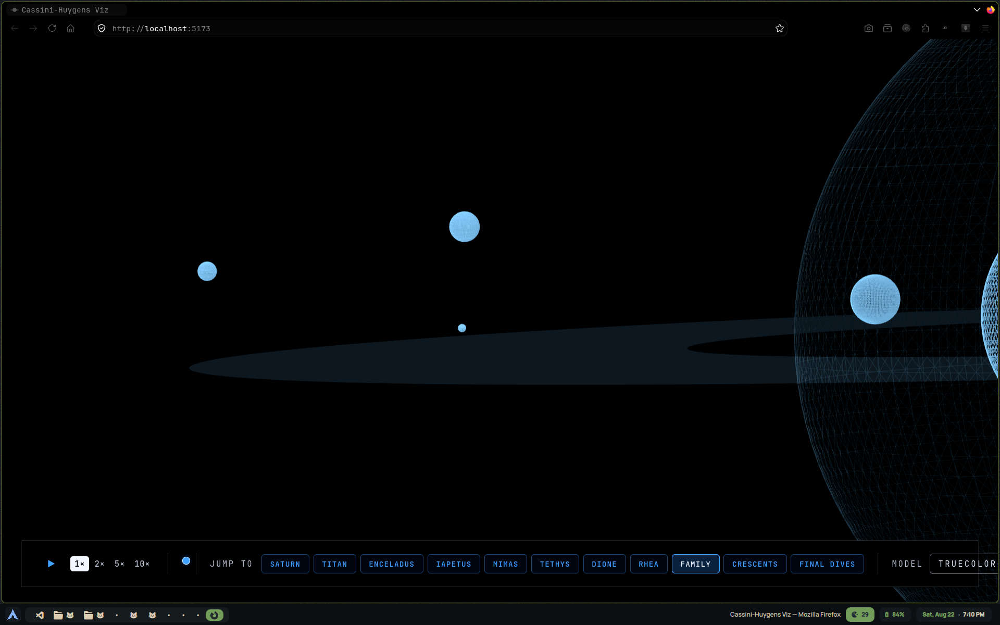

# Cassini

  

An interactive 3D visualization of the Cassini-Huygens mission: the 1997
launch, seven-year cruise, 13 years orbiting Saturn, and the spacecraft's
final plunge into Saturn's atmosphere on September 15, 2017.

Built with React, [React Three Fiber](https://docs.pmnd.rs/react-three-fiber),
Three.js, zustand, and Vite.

## WORK IN PROGRESS!!

  

