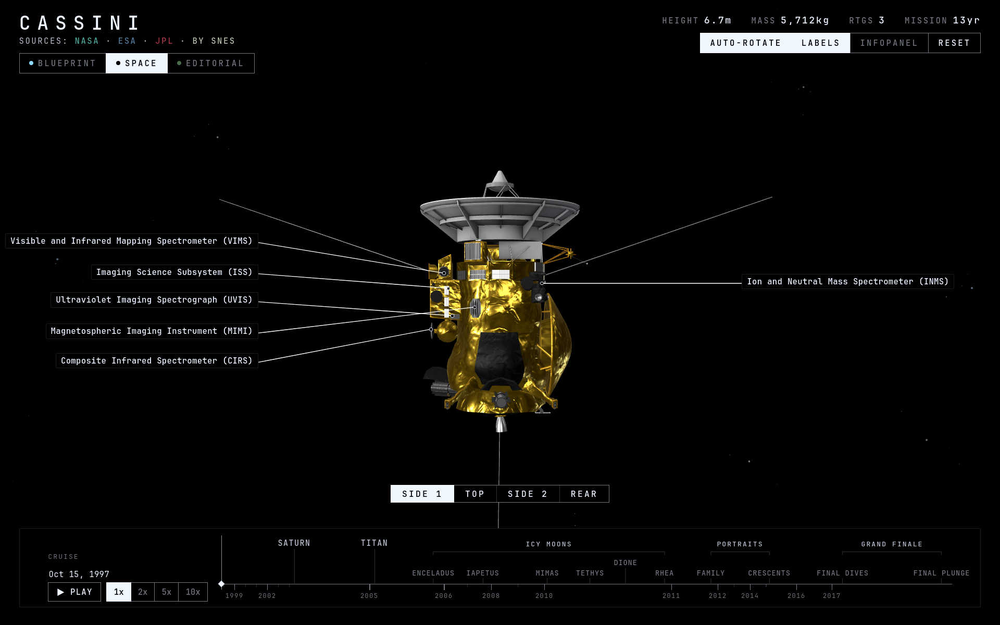
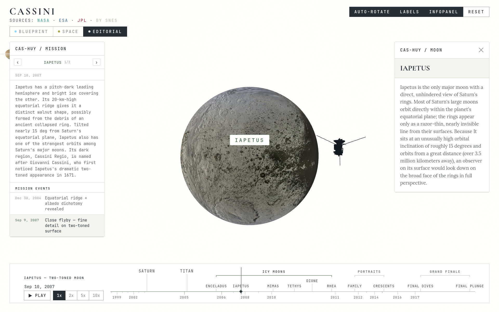
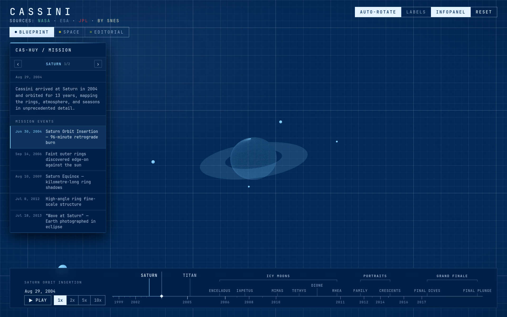
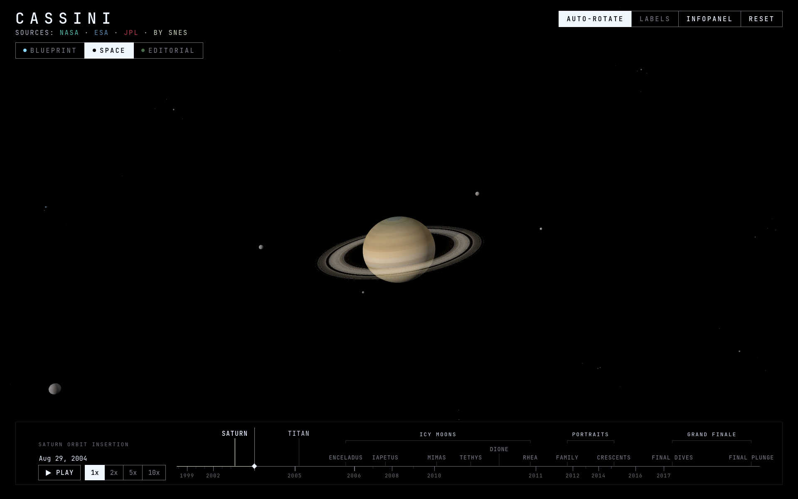

# Cassini

  

An interactive 3D web application that visualizes the twenty-year journey of the Cassini-Huygens mission to Saturn, from its 1997 launch to its final atmospheric entry on September 15, 2017.

The entire mission plays as a continuous interactive sequence lasting just under five minutes (299.99 seconds at 1x speed). The viewer can let the mission play in real time, scrub along the timeline, pause at any moment, orbit the camera around the spacecraft or moons, inspect scientific instruments, and cycle through visual themes and spectral views.

This project is a personal educational reconstruction built with React 19, React Three Fiber, Three.js,Zustand and Vite.

## Table of Contents

- [Core Architecture and Design](#core-architecture-and-design)
  - [Normalized Time and Non-Uniform Remapping](#normalized-time-and-non-uniform-remapping)
  - [Tableau Staging System](#tableau-staging-system)
  - [Rendering and Performance Pipeline](#rendering-and-performance-pipeline)
- [Mission Scenes and Sequence](#mission-scenes-and-sequence)
  - [1. Interplanetary Cruise](#1-interplanetary-cruise-cruise_early-t--0000-to-0180)
  - [2. Saturn Orbit Insertion](#2-saturn-orbit-insertion-saturn_arrival-t--0180-to-0353)
  - [3. Titan and the Huygens Landing](#3-titan-and-the-huygens-landing-titan_huygens-t--0353-to-0420)
  - [4. Moon Portraits](#4-moon-portraits-t--0420-to-0810)
  - [5. Recreated Historical Photographs](#5-recreated-historical-photographs)
  - [6. The Grand Finale](#6-the-grand-finale-t--0945-to-1000)
- [User Controls and Interaction](#user-controls-and-interaction)
  - [Navigation and Playback](#navigation-and-playback)
  - [Camera Controls](#camera-controls)
  - [Scientific Exploration](#scientific-exploration)
- [Notes](#notes)
- [Screenshots](#screenshots)
- [Credits and Sources](#credits-and-sources)

## Core Architecture and Design

The application does not run a physics simulation based on orbital ephemerides. Distances in the Saturnian system span millions of kilometers, while the spacecraft itself is only 6.7 meters tall. Real-scale orbital mechanics would render the spacecraft invisible and require astronomical camera clipping planes that cause extreme z-fighting.

Instead, the visualization uses an authored tableau architecture driven by a single normalized mission progress parameter.

### Normalized Time and Non-Uniform Remapping

The entire mission lifecycle is mapped to a single scalar `t` ranging from `0.0` (launch on October 15, 1997) to `1.0` (loss of signal on September 15, 2017).

Because the physical time is very uneven, with seven years of mostly empty travel followed by only a few hours of frantic science work, the display time does not follow mission time directly. Instead, it uses a piecewise linear mapping defined in `src/scenes/cassini/lib/tRemap.ts`:

- Cruise (1997 to 2004): 4.3 seconds of playback.
- Saturn Orbit Insertion approach and fling: 35.7 seconds.
- Moon studies (Titan, Enceladus, Iapetus, Mimas, Tethys, Dione, Rhea): 10 to 18 seconds each.
- Five-moon Family Portrait: 12.4 seconds.
- Three Crescents portrait: 13.0 seconds.
- Grand Finale Swing Around: 31.0 seconds.
- Ring Dive sequence: 60.0 seconds.
- Saturn's Atmosphere entry: 23.7 seconds.
- Disintegration and End of Mission: 7.3 seconds.

Dates shown in the UI are linearly interpolated between twelve fixed historical date anchors in `src/scenes/cassini/data/missionDates.ts`.

### Tableau Staging System

Rather than placing all bodies in one continuous coordinate space, the mission is broken into discrete tableaus defined in `src/scenes/cassini/data/tableaus.ts`. Each tableau is a self-contained scene with its own coordinate origin, focal subject, camera framing presets, field of view, zoom clamps, and optional Saturn backdrop.

During playback or scrubbing, `getActiveTableau(t)` evaluates the active scene. Camera transitions between tableaus are handled by `TransitionDriver.tsx` and `traverseShot.ts`, which compute smooth camera corridors and target interpolations so scenes blend together without sudden jumps.

### Rendering and Performance Pipeline

The animation timing is kept in sync by updating the mission time on every frame before any other component reads it, which prevents camera and trajectory jitter. To reduce unnecessary React updates, components subscribe only to the specific values they need, while the timeline and telemetry panels update at 12 Hz instead of every frame. The renderer also uses a logarithmic depth buffer to prevent visual conflicts between objects at very different scales, such as Saturn’s rings, atmosphere, and the spacecraft. Finally, tone mapping is disabled so the NASA surface colours and brightness gradients are displayed without additional filmic processing.The animation timing is kept in sync by `MissionTimeAdvancer` in `MissionTimeAdvancer.ts`, which updates the mission time on every frame before other components read it. This prevents camera and trajectory jitter. Components subscribe only to the values they need, while `useThrottledMissionT` in `useThrottledMissionT.ts` limits timeline and telemetry updates to 12 Hz, reducing unnecessary React re-renders. The WebGL renderer enables a logarithmic depth buffer in `Canvas.tsx` to prevent visual conflicts between objects at very different scales, such as Saturn’s rings, atmosphere, and spacecraft. Finally, `Canvas.tsx` disables tone mapping so NASA surface colours and brightness gradients are displayed without additional filmic processing.

## Mission Scenes and Sequence

### 1. Interplanetary Cruise (`cruise_early`, t = 0.000 to 0.180)

Cassini travels alone through deep space. This stage is also the application homepage. Users can orbit the camera freely around the spacecraft, toggle instrument labels, and rotate the model.

### 2. Saturn Orbit Insertion (`saturn_arrival`, t = 0.180 to 0.353)

Cassini approaches Saturn from the sunlit side. The camera executes a long dolly toward the planet while inner moons (Rhea, Dione, Tethys, Enceladus, Mimas) orbit on their true scaled radii. The 96-minute main engine retrograde burn is tracked in mission telemetry.

### 3. Titan and the Huygens Landing (`titan_huygens`, t = 0.353 to 0.420)

Cassini studies Saturn's largest moon while the European Space Agency's Huygens probe separates and descends through Titan's orange smog.

- Features: Huygens descent visualization, DISR instrument telemetry, and a toggleable shoulder tracking camera that stays locked on Huygens during its fall to the surface.
- Spectral Views: The UI allows switching Titan's surface between natural visible haze (ISS RGB), false-color infrared (VIMS 5.0 / 2.0 / 1.3 microns), near-IR surface methane windows (ISS CB3 938 nm), and naturalistic near-IR.

### 4. Moon Portraits (t = 0.420 to 0.810)

Dedicated close-up studies of Saturn's icy moons, each framed with a proportionally scaled Saturn backdrop:

- Enceladus (`enceladus`, t = 0.420 to 0.490): An active ice world. Includes a toggleable particle simulation of the south-polar cryovolcanic geyser plumes that feed Saturn's E ring, plus a VIMS infrared mode.
- Iapetus (`iapetus`, t = 0.490 to 0.580): The two-toned walnut moon. Features its 20-kilometer equatorial ridge and stark albedo contrast between dark Cassini Regio and bright trailing ice.
- Mimas (`mimas`, t = 0.580 to 0.640): Dominated by the 130-kilometer Herschel impact basin.
- Tethys (`tethys`, t = 0.640 to 0.690): Showcases the massive Ithaca Chasma trench system and Odysseus crater.
- Dione (`dione`, t = 0.690 to 0.745): Shows tectonic fracture cliffs on the trailing hemisphere.
- Rhea (`rhea`, t = 0.745 to 0.810): Saturn's second-largest moon, noting its tenuous oxygen and carbon dioxide exosphere.

### 5. Recreated Historical Photographs

- Family Portrait (`family_portrait`, t = 0.810 to 0.870): A 3D recreation of NASA release PIA14573 (captured July 29, 2011). Five moons appear in one frame: Janus, Pandora, Enceladus, Rhea, and Mimas. The moons are set to true relative physical scale, with real orbital inclinations, tidally locked rotation periods, and proportional orbital drift.
- Three Crescents (`three_crescents`, t = 0.870 to 0.945): A recreation of NASA release PIA18322 (captured March 25, 2015). A telephoto 14-degree camera frames Titan, Rhea, and Mimas backlit as razor-thin crescents against Saturn (which does not appear in the real image).

### 6. The Grand Finale (t = 0.945 to 1.000)

Cassini's dramatic final phase:

- Swing Around (`finale_swing_around`, t = 0.945 to 0.978): High-inclination orbit soaring over Saturn's north pole and hexagonal jet stream.
- Ring Dive (`finale_ring_dive`, t = 0.978 to 0.994677): Cassini punches through the ring plane and threads the narrow gap inside the D ring at 34 km/s. Users can switch between third-person chase, forward velocity POV, and wide orbital camera modes.
- Saturn's Atmosphere (`finale_atmospheric`, t = 0.994677 to 0.999115): The terminal entry. Cassini enters the upper atmosphere at 9.4 degrees north latitude. The scene transitions to a soft cloud deck shader, horizon haze gradient, and glowing entry contrail.
- End of Mission (`finale_disintegration`, t = 0.999115 to 1.000): Cassini experiences peak thermal heating, aerodynamic tumbling, and vehicle disintegration. The screen flashes to white and transitions to an interactive loss-of-signal card plotting the carrier signal decay at 11:55:46 UTC on September 15, 2017.

## User Controls and Interaction

### Navigation and Playback

- Play / Pause: Click the timeline button or press `Space` key.
- Step Tableaus: Click any tableau tick on the timeline, use the JUMP-TO menu, or press the `Left Arrow` / `Right Arrow` keys.
- Scrub: Click and drag along the bottom timeline.
- Playback Speed: Cycle between 1x, 2x, 5x, and 10x speeds.
- Reset: From any point, click `RESET` in the top right to return to the beginning of the mission.

### Camera Controls

- Orbit: Left-click and drag (or single-finger drag on touch screens).
- Zoom: Scroll wheel (or pinch to zoom on touch screens).
- Pan: Right-click and drag (or two-finger drag on touch screens).
- Auto-Rotate: Toggle automated camera orbiting using the `AUTO-ROTATE` button.

### Scientific Exploration

- Spacecraft Inspection: Click `LABELS` while on the homepage to inspect Cassini.
- Moon Fact Panels: In moon scenes or group portraits, click body labels to open geological summaries.
- Spectral Selector: In the Titan scene, switch between Visible, Infrared, and Near-IR filters.
- Plumes Toggle: In the Enceladus scene, toggle the south-polar geyser plumes on or off.
- Lighting Modes: Toggle the `LIGHTING` button to cycle between Natural (directional sunlight), Rim (back-fill to reveal the night side), and Full (unobstructed flat inspection light).

## Notes

I used several deliberate liberties were taken to create an engaging visual experience:

1. Mission Duration: The real twenty-year mission is compressed into 5 minutes. Time accelerates during empty cruise and slows down during close encounters and entry.
2. Coordinate Systems: Units and scales are authored per scene. Moons do not move along continuous Keplerian orbits around Saturn; each tableau places its focal body at the local origin to provide smooth camera framing.
3. Apparent Moon Radii: Moon sizes in solo tableaus are stylized (Titan radius 50, Mimas radius 18). In reality, Titan is 13 times larger than Mimas; using true scale would reduce Mimas to a single pixel on screen.
4. Ring Crossings: The real Grand Finale performed 22 ring-gap crossings. The visualization has only six key passes (including the B-ring penetration and the Final Five) to keep the scrubber readable and visually distinct.
5. Atmospheric Entry: The terminal fireball, plasma trail, and meteor breakup are timed to dramatic cinematic cues inspired by a NASA JPL video rather than a computational ablation model.
6. Multi-Moon Alignments: The Family Portrait and Three Crescents tableaus preserve accurate moon spin axes and relative sizes, but camera distances and backdrop placements are tuned to match the famous photographs within an interactive viewport.

## Screenshots

  
  
  
  

## Credits and Sources

- The theme and UI is based almost entirely on @redradman's [Artemis](https://github.com/redradman/artemis). I also decided on the architecture based on this project.
- Mission Telemetry and Timelines: NASA/JPL Cassini launch and arrival press kits, the Grand Finale press kit, and the JPL DESCANSO Telecom Summary.
- Surface Textures and Maps:
  - [Steve Albers' planetary maps](https://stevealbers.net/albers/sos/sos.html.050613): Used as a true colour guide to colour correct NASA/JPL's high-contrast false colour maps for Tethys and Rhea.
  - Enceladus and Mimas: Edited and processed directly.
  - Titan enhanced colour texture map by [askaniy](https://www.deviantart.com/askaniy/art/Titan-Enhanced-Color-Map-11K-1066578731).
  - Titan true colour by [ducn1567](https://www.deviantart.com/ducn1567/art/Titan-Texture-2K-1014816449).
  - Titan infrared was Converted into an equirectangular map from spherical projections in [PIA21923: Seeing Titan with Infrared Eyes](https://www.jpl.nasa.gov/images/pia21923-seeing-titan-with-infrared-eyes/) using `scripts/titan_maker.py`.
  - Titan false colour (`titan_false_color_IR_opt.webp`): Modelled from [Mapping Titan's Changes](https://science.nasa.gov/resource/mapping-titans-changes/).
  - Enceladus infrared: Sourced from [PIA24027: Enceladus in the Infrared (Map View)](https://www.jpl.nasa.gov/images/pia24027-enceladus-in-the-infrared-map-view/).
  - Additional baseline releases: NASA/JPL-Caltech imaging archives.
- Ring Profiles: Baked from Björn Jónsson's radial occultation profiles and brightness data.
- Atmosphere Limb Profile: Sampled from Cassini ISS natural-color image PIA21046.
- Spacecraft Models: Converted and optimized from NASA/JPL 3D resources.
- Assisted during development by Google Gemini (3.1 pro and 3.8 flash) using agy (used to be gemini-cli when I started) and Anthropic's claude (free)
